# AWS Bedrock RAG Example - Sistema di Ricerca e Generazione Aumentata

## 🚀 Panoramica

Questo esempio implementa un sistema **RAG (Retrieval-Augmented Generation)** completo utilizzando i servizi AWS, con particolare focus su **Amazon Bedrock** per l'intelligenza artificiale. Il sistema permette di caricare documenti, indicizzarli semanticamente e interrogarli in linguaggio naturale, combinando la potenza dei modelli di embedding e chat di AWS Bedrock.

### 🔧 Architettura del Sistema

```mermaid
graph TB
    subgraph "Client Layer"
        A[🌐 Frontend Web<br/>HTML/JavaScript]
    end
    
    subgraph "Application Layer"
        B[⚡ FastAPI Backend<br/>Python REST API]
    end
    
    subgraph "AI Layer"
        C[🤖 Amazon Bedrock<br/>Titan Embed + Llama 3.2]
    end
    
    subgraph "Storage Layer"
        D[🗄️ ChromaDB<br/>Vector Database]
        E[☁️ Amazon S3<br/>Document Storage]
    end
    
    A -.->|HTTP Requests| B
    B -.->|Embedding & Chat| C
    B -.->|Vector Search| D
    B -.->|File Upload/Download| E
    
    style A fill:#e1f5fe
    style B fill:#f3e5f5
    style C fill:#fff3e0
    style D fill:#e8f5e8
    style E fill:#fff8e1
```



**🔄 Flusso di Lavoro:**
1. **📄 Ingestione**: Upload documento → Chunking → Embedding (Bedrock) → Storage (ChromaDB + S3)
2. **🔍 Query**: Domanda utente → Embedding → Ricerca vettoriale → Generazione risposta (Bedrock)
3. **💾 Persistenza**: Documenti originali su S3, embeddings su ChromaDB locale

### 🎯 Funzionalità Principali

- **📄 Ingestione Documenti**: Caricamento e indicizzazione automatica di file di testo
- **🔍 Ricerca Semantica**: Query in linguaggio naturale sui documenti indicizzati
- **🤖 Generazione AI**: Risposte generate usando modelli Bedrock (Llama 3.2)
- **💾 Persistenza**: Salvataggio documenti su S3 e embeddings su ChromaDB
- **🌐 Interfaccia Web**: Frontend interattivo per testing delle API

## 🏗️ Componenti Tecnici

### Backend (FastAPI)
- **File**: `example01.py`
- **Framework**: FastAPI con CORS abilitato
- **Funzioni principali**:
  - `/health` - Health check del servizio
  - `/ingest` - Caricamento e indicizzazione documenti
  - `/query` - Ricerca RAG nei documenti
  - `/generate` - Generazione diretta con AI

### Modelli AI (Amazon Bedrock)
- **Embedding Model**: `amazon.titan-embed-text-v2:0` (1024 dimensioni)
- **Chat Model**: `meta.llama3-2-3b-instruct-v1:0`
- **Inference Profile**: Ottimizzazione per la regione EU

### Storage e Database
- **Vector Database**: ChromaDB (locale, persistente)
- **File Storage**: Amazon S3 per backup documenti originali
- **Configurazione**: Directory `./chroma` per persistenza locale

### Frontend
- **File**: `web/index.html` e `web/index.js`
- **Funzionalità**: Interfaccia interattiva per testing API
- **Deploy**: Servito tramite Apache su porta 80

## 🛠️ Installazione e Deploy

### Opzione 1: Deploy Automatico con Script

```bash
# Clona il repository
git clone https://github.com/alnao/PythonExamples.git
cd PythonExamples/AWS/Bedrock/example01

# Rendi eseguibile lo script
chmod +x bedrock_rag_stack.sh

# Crea l'intera infrastruttura
./bedrock_rag_stack.sh create ragdemo eu-central-1
```

Lo script automatizza:
- ✅ Creazione bucket S3
- ✅ Setup IAM role e policy
- ✅ Configurazione Security Group
- ✅ Launch istanza EC2 con user data
- ✅ Installazione automatica del servizio

### Opzione 2: Installazione Manuale

#### 1. Prerequisiti AWS
```bash
# Abilita i modelli Bedrock (Console AWS)
# - Amazon Titan Embed Text v2
# - Meta Llama 3.2 3B Instruct

# Verifica modelli disponibili
aws bedrock list-foundation-models --region eu-central-1 \
  --query "modelSummaries[?contains(modelId, 'embed')].{ModelId:modelId,Status:modelLifecycle.status}" \
  --output table
```

#### 2. Setup Infrastruttura
```bash
# Crea bucket S3
aws s3 mb s3://ragdemo-alnao-bucket --region eu-central-1

# Crea IAM policy
aws iam create-policy --policy-name ragdemo-policy \
  --policy-document file://policy.json

# Crea IAM role
aws iam create-role --role-name ragdemo-role \
  --assume-role-policy-document file://trust-policy.json

# Associa policy al role
aws iam attach-role-policy --role-name ragdemo-role \
  --policy-arn arn:aws:iam::ACCOUNT:policy/ragdemo-policy
```

#### 3. Setup EC2
```bash
# Launch istanza Ubuntu 22.04
aws ec2 run-instances --image-id ami-xxxxxxxxx \
  --instance-type t3.micro --key-name your-key \
  --iam-instance-profile Name=ragdemo-role \
  --user-data file://user_data.sh
```

#### 4. Installazione Applicazione
```bash
# Connetti via SSH all'istanza
ssh -i your-key.pem ubuntu@IP_PUBBLICO

# Clona e installa
git clone https://github.com/alnao/PythonExamples.git app
cd app/AWS/Bedrock/example01

# Setup Python environment
python3.10 -m venv venv
source venv/bin/activate
pip install fastapi uvicorn[standard] boto3 pydantic-settings python-multipart chromadb tiktoken

# Avvia il servizio
nohup venv/bin/uvicorn example01:app --host 0.0.0.0 --port 8000 > fastapi.log 2>&1 &
```

## 🧪 Testing del Sistema

### API Testing con curl

```bash
# Health check
curl http://IP_PUBBLICO:8000/health

# Carica un documento
curl -X POST http://IP_PUBBLICO:8000/ingest \
  -F "file=@document.txt" \
  -F "doc_id=mydoc1"

# Interroga i documenti
curl -X POST "http://IP_PUBBLICO:8000/query?q=What%20is%20AWS%20Bedrock?&k=4" | jq

# Generazione diretta
curl -X POST "http://IP_PUBBLICO:8000/generate" \
  -H "Content-Type: application/json" \
  -d '{"prompt": "Explain machine learning in simple terms"}'
```

### Interfaccia Web
Accedi a `http://IP_PUBBLICO` per utilizzare l'interfaccia grafica interattiva.

## 💰 Analisi dei Costi

### Costi AWS per 10 Utenti/Giorno

**Scenario**: 10 utenti, 5 query al giorno, 2 documenti caricati/settimana

| Servizio | Utilizzo | Costo Mensile |
|----------|----------|---------------|
| **EC2 t3.micro** | 24/7 | €8.50 |
| **S3 Standard** | 1GB storage, 1000 PUT | €0.25 |
| **Bedrock Titan Embed** | 15,000 token/mese | €0.15 |
| **Bedrock Llama 3.2** | 75,000 token/mese | €0.60 |
| **Data Transfer** | 1GB out | €0.90 |
| **TOTALE** | | **€10.40/mese** |

### Costi AWS per 1000 Utenti/Giorno

**Scenario**: 1000 utenti, 5 query al giorno, 50 documenti caricati/settimana

| Servizio | Utilizzo | Costo Mensile |
|----------|----------|---------------|
| **EC2 t3.large** | 24/7 (scaling) | €68.00 |
| **S3 Standard** | 50GB storage, 50K PUT | €12.50 |
| **Bedrock Titan Embed** | 1.5M token/mese | €15.00 |
| **Bedrock Llama 3.2** | 7.5M token/mese | €60.00 |
| **Data Transfer** | 100GB out | €90.00 |
| **Application Load Balancer** | Per alta disponibilità | €22.50 |
| **TOTALE** | | **€268.00/mese** |


## 🚀 Miglioramenti e Sviluppi Futuri

### 🔒 Sicurezza e Autenticazione
```python
# Implementazione JWT Authentication
from fastapi.security import HTTPBearer
from jose import JWTError, jwt

security = HTTPBearer()

@app.post("/query")
async def query(q: str, token: str = Depends(security)):
    # Validazione token JWT
    payload = jwt.decode(token, SECRET_KEY, algorithms=["HS256"])
    user_id = payload.get("sub")
    # Procedi con la query...
```

### 📊 Monitoring e Observability
```python
# CloudWatch Metrics Integration
import boto3
cloudwatch = boto3.client('cloudwatch')

def log_metrics(query_time, tokens_used, user_id):
    cloudwatch.put_metric_data(
        Namespace='RAG/Performance',
        MetricData=[
            {
                'MetricName': 'QueryLatency',
                'Value': query_time,
                'Unit': 'Seconds'
            },
            {
                'MetricName': 'TokensConsumed',
                'Value': tokens_used,
                'Unit': 'Count'
            }
        ]
    )
```

### 🎯 Chunking Intelligente
```python
# Implementazione RecursiveCharacterTextSplitter
from langchain.text_splitter import RecursiveCharacterTextSplitter

splitter = RecursiveCharacterTextSplitter(
    chunk_size=1000,
    chunk_overlap=200,
    separators=["\n\n", "\n", ".", "!", "?", ",", " ", ""]
)

chunks = splitter.split_text(document_text)
```

### 🔄 Caching e Performance
```python
# Redis Cache per Embeddings
import redis
import pickle

redis_client = redis.Redis(host='localhost', port=6379, db=0)

def cached_embed(text: str) -> List[float]:
    cache_key = f"embed:{hash(text)}"
    cached = redis_client.get(cache_key)
    
    if cached:
        return pickle.loads(cached)
    
    embedding = bedrock_embed([text])[0]
    redis_client.setex(cache_key, 3600, pickle.dumps(embedding))
    return embedding
```

### 🌐 Multi-Modal Support
```python
# Support per immagini con Bedrock Multimodal
@app.post("/ingest-image")
async def ingest_image(file: UploadFile = File(...)):
    # Utilizza Claude 3 per estrarre testo da immagini
    image_bytes = await file.read()
    
    response = bedrock.invoke_model(
        modelId="anthropic.claude-3-sonnet-20240229-v1:0",
        body=json.dumps({
            "anthropic_version": "bedrock-2023-05-31",
            "max_tokens": 1000,
            "messages": [{
                "role": "user",
                "content": [{
                    "type": "image",
                    "source": {
                        "type": "base64",
                        "media_type": "image/jpeg",
                        "data": base64.b64encode(image_bytes).decode()
                    }
                }]
            }]
        })
    )
```

### 📈 Scalabilità Avanzata

#### Auto Scaling Group
```yaml
# CloudFormation template per ASG
AutoScalingGroup:
  Type: AWS::AutoScaling::AutoScalingGroup
  Properties:
    MinSize: 1
    MaxSize: 10
    DesiredCapacity: 2
    TargetGroupARNs:
      - !Ref ApplicationLoadBalancerTargetGroup
    HealthCheckType: ELB
    HealthCheckGracePeriod: 300
```

#### Database Distribuito
```python
# Migrazione a Pinecone per vector database scalabile
import pinecone

pinecone.init(api_key="your-api-key", environment="us-west1-gcp")
index = pinecone.Index("rag-embeddings")

def store_embeddings(embeddings, metadata):
    vectors = [(str(i), emb, meta) for i, (emb, meta) in enumerate(zip(embeddings, metadata))]
    index.upsert(vectors=vectors)
```

### 🔍 Analytics e BI
```python
# Integration con Amazon QuickSight
def generate_usage_report():
    return {
        "daily_queries": get_query_count_today(),
        "top_topics": get_most_queried_topics(),
        "user_engagement": calculate_engagement_metrics(),
        "cost_analysis": get_daily_aws_costs()
    }
```


# &lt; AlNao /&gt;
Tutti i codici sorgente e le informazioni presenti in questo repository sono frutto di un attento e paziente lavoro di sviluppo da parte di AlNao, che si è impegnato a verificarne la correttezza nella misura massima possibile. Qualora parte del codice o dei contenuti sia stato tratto da fonti esterne, la relativa provenienza viene sempre citata, nel rispetto della trasparenza e della proprietà intellettuale. 


Alcuni contenuti e porzioni di codice presenti in questo repository sono stati realizzati anche grazie al supporto di strumenti di intelligenza artificiale, il cui contributo ha permesso di arricchire e velocizzare la produzione del materiale. Ogni informazione e frammento di codice è stato comunque attentamente verificato e validato, con l’obiettivo di garantire la massima qualità e affidabilità dei contenuti offerti. 


Per ulteriori dettagli, approfondimenti o richieste di chiarimento, si invita a consultare il sito [AlNao.it](https://www.alnao.it/).


## License
Made with ❤️ by <a href="https://www.alnao.it">AlNao</a>
&bull; 
Public projects 
<a href="https://www.gnu.org/licenses/gpl-3.0"  valign="middle"> </a>
*Free Software!*


Il software è distribuito secondo i termini della GNU General Public License v3.0. L'uso, la modifica e la ridistribuzione sono consentiti, a condizione che ogni copia o lavoro derivato sia rilasciato con la stessa licenza. Il contenuto è fornito "così com'è", senza alcuna garanzia, esplicita o implicita.


The software is distributed under the terms of the GNU General Public License v3.0. Use, modification, and redistribution are permitted, provided that any copy or derivative work is released under the same license. The content is provided "as is", without any warranty, express or implied.

